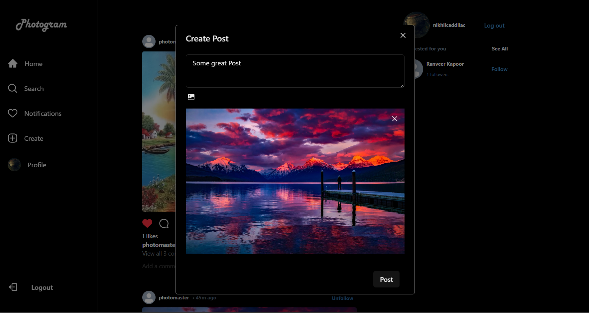

Photogram - An image sharing social media platform

Try it out [here](https://photogram-eight.vercel.app/)

<!--  -->

Watch the demo on Youtube

[](http://www.youtube.com/watch?v=O-jrVEzI-ZU "Photogram")

<!--  -->

Some screenshots:





To run -> 
```
npm run dev
```

Tools used for this project
- React
- Firebase
- Vite
- ChakraUI

React offers a component based approach to build frontend


ChakraUI has many common elements already defined for us to use
ChakraUI has Text, Avatar, VStack, Flexbox, Modal, Button etc


Vite is an alternative to create-react-app, it offers faster build speeds and supports a variety of frameworks
Firebase is used for backend


Zustand - Global State management for React, to change frontend values like Followers, Likes etc as soon as they are changed in backend
Zustand is mainly used used for state management, so that our changes immediately reflect, also used for chaning state between homepage and login page 

React-firebase-hooks - React for firebase, it has many common use-case function like sign in with email, with Google, passowrd, logout, giving error codes etc

Firebase - used for authentication, storage, and database, images are stored as base64 encoded string and they have a maximum size of 2Mb
Database is of users(followers, posts etc)
of Posts(image url, likes, comments etc)
of comments(author content, created at etc)

Consists of reusable components and hooks like usePreviewImg.js which is used to select new profile picture in edit profile and create new post in photogram

**You must add a .env file at the root of the project with the following variables from your own firebase account**

```
FIREBASE_APIKEY,

FIREBASE_AUTHDOMAIN,

FIREBASE_PROJECTID,

FIREBASE_STORAGEBUCKET,

FIREBASE_MESSAGINGSENDERID,

FIREBASE_APPID,

FIREBASE_MEASUREMENTID
```